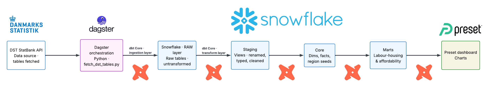
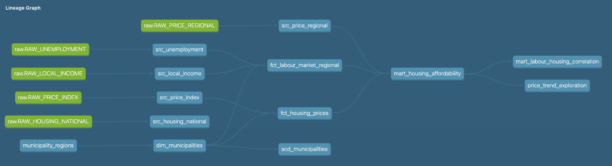
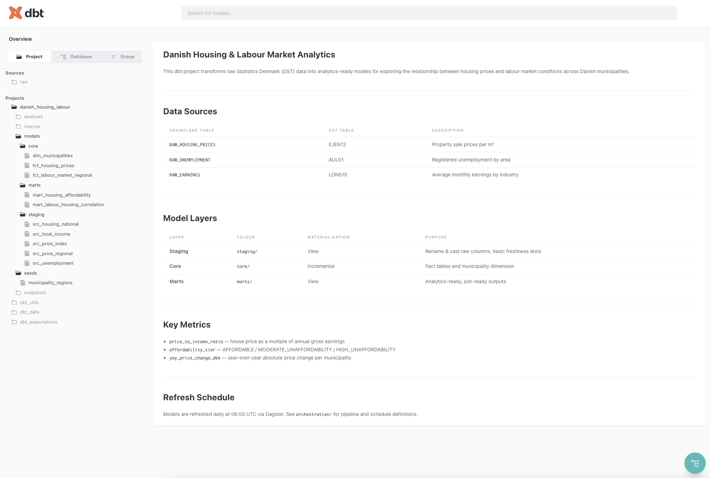

# Danish Housing & Labour Market Analytics

End-to-end ELT pipeline that ingests Statistics Denmark (DST) data into Snowflake,
transforms it with dbt Core, and orchestrates everything with Dagster.

**Research questions:**
- Does rising unemployment predict slower housing price growth by region?
- Are regions with persistently low unemployment also the most expensive?

---

## Stack

| Layer | Tool |
|---|---|
| Ingestion | Python (`fetch_dst_tables.py`) → Snowflake RAW schema |
| Warehouse | Snowflake (key-pair auth) |
| Transformation | dbt Core 1.x |
| Orchestration | Dagster Cloud (hybrid: cloud UI + local agent) |
| BI | Preset (preset.io), read-only `PRESET_READER` role |



---

## Project Structure

```
danish_housing_labour/
├── ingestion/                  # Python: DST StatBank API → Snowflake RAW
│   ├── fetch_dst_tables.py     # POST-based DST API fetch with retry logic
│   └── requirements.txt
├── dbt_project/                # dbt Core: staging → core → marts
│   ├── models/
│   │   ├── staging/            # 5 source views: rename, cast, alias Danish chars
│   │   ├── core/               # 1 dim table + 2 incremental fact tables
│   │   └── marts/              # 2 analytics-ready views
│   ├── seeds/                  # municipality_regions.csv (98 rows)
│   ├── docs/                   # dbt docs overview page
│   └── dbt_project.yml
└── orchestration/              # Dagster: asset definitions + daily schedule
```

---

## Data Sources

| DST Table | Snowflake RAW Table | Description | Grain |
|-----------|---------------------|-------------|-------|
| EJ56 | `RAW_PRICE_INDEX` | Property price index (2022=100) by region | Quarterly |
| EJ131 | `RAW_PRICE_REGIONAL` | Sales key figures by region (avg price, volume) | Monthly |
| AUL01 | `RAW_UNEMPLOYMENT` | Gross unemployment by municipality | Annual |
| INDKP101 | `RAW_LOCAL_INCOME` | Disposable income by municipality | Annual |
| LABY22 | `RAW_HOUSING_NATIONAL` | National property sales benchmarks | Annual |

> **Geography note:** Housing price data (EJ56, EJ131) is published at **region level** only
> (5 regions). Municipality-level unemployment and income (AUL01, INDKP101) are aggregated
> to region level via the `municipality_regions` seed. EJEN12 (municipality-level prices)
> was evaluated but found inactive since 2009 and excluded.

---

## dbt Model Inventory

**10 models total · 56 tests passing**

| Model | Layer | Materialisation | Description |
|-------|-------|-----------------|-------------|
| `src_price_index` | Staging | View | EJ56 — quarterly price index by region |
| `src_price_regional` | Staging | View | EJ131 — monthly avg price & sales count |
| `src_unemployment` | Staging | View | AUL01 — gross unemployment by municipality |
| `src_local_income` | Staging | View | INDKP101 — disposable income by municipality |
| `src_housing_national` | Staging | View | LABY22 — national sales benchmarks |
| `dim_municipalities` | Core | Table | 98 municipalities → 5 region mapping |
| `fct_housing_prices` | Core | Incremental | Region × quarter housing price fact |
| `fct_labour_market_regional` | Core | Incremental | Region × year labour market fact |
| `mart_housing_affordability` | Marts | View | Price index + income + price-to-income ratio |
| `mart_labour_housing_correlation` | Marts | View | Adds `affordability_tier`, data quality flags |



### Snowflake Schema Names

With `schema: dbt_dev` set in `profiles.yml`, dbt prefixes all custom schemas:

| dbt layer | Actual Snowflake schema |
|-----------|------------------------|
| staging | `DBT_DEV_STAGING` |
| core | `DBT_DEV_CORE` |
| marts | `DBT_DEV_MARTS` |
| seeds | `DBT_DEV_SEEDS` |

---

## Quick Start

### Prerequisites

- Python 3.11+
- Snowflake account with key-pair auth configured
- dbt Core installed (`pip install dbt-snowflake`)
- Private key at `~/.snowflake/rsa_key.p8`

### 1 — Ingest raw data

```bash
cd ingestion
pip install -r requirements.txt
python fetch_dst_tables.py
```

Loads all 5 DST tables into Snowflake `DANISH_HOUSING.RAW.*`.

### 2 — Run dbt

```bash
cd dbt_project
dbt deps           # install packages
dbt seed           # load municipality_regions.csv
dbt build          # run + test all 10 models
dbt docs generate
dbt docs serve
```



### 3 — Orchestration (Dagster)

```bash
cd orchestration
pip install -r requirements.txt
dagster dev        # start local Dagster instance
```

Assets and a daily 06:00 UTC schedule are defined in `orchestration/definitions.py`.
For Dagster Cloud deployment see `orchestration/README.md`.

---

## Authentication

Snowflake connection uses key-pair authentication. See the example below. 

```bash
export SNOWFLAKE_ACCOUNT="<snowflake_account>"
export SNOWFLAKE_USER="<snowflake_user>"
export SNOWFLAKE_PRIVATE_KEY_PATH="<path_to_rsa_key.p8>"
export SNOWFLAKE_PRIVATE_KEY_PASSPHRASE="<passphrase>"
export SNOWFLAKE_ROLE="TRANSFORMER"
export SNOWFLAKE_DATABASE="DANISH_HOUSING"
export SNOWFLAKE_WAREHOUSE="COMPUTE_WH"
```

---

## Key Metrics

| Metric | Description |
|--------|-------------|
| `avg_annual_price_index` | Annual average of quarterly price index (2022=100) |
| `avg_yoy_price_change_pct` | Year-over-year % change in price index |
| `avg_annual_price_mdkk` | Average property sale price in DKK millions |
| `price_to_income_ratio` | `avg_annual_price_mdkk × 1M ÷ avg_disposable_income_dkk` |
| `affordability_tier` | `AFFORDABLE` / `MODERATE_UNAFFORDABILITY` / `HIGH_UNAFFORDABILITY` |
| `total_gross_unemployment` | Summed gross unemployment across region's municipalities |

---

## Known Limitations

- **Mean income, not median.** DST StatBank API publishes municipality-level income as
  arithmetic mean. This over-represents high earners but is consistently biased across
  regions, so relative rankings remain valid.
- **Region-level housing only.** EJ56 and EJ131 provide data at region level (5 regions),
  not municipality level. Municipality-level price analysis was not possible with current
  active DST tables.
- **One-family houses only.** All housing price analysis is filtered to
  `EJENDOMSKATE = 'One-family houses'` across EJ56, EJ131, and LABY22.
  Owner-occupied flats and weekend cottages are excluded. This means results
  reflect the detached and semi-detached house market and may not represent
  affordability dynamics in urban areas where flat ownership dominates
  (notably Region Hovedstaden).
- **DST null sentinels.** DST encodes suppressed values as `".."` and missing as `":"`.
  These are converted to SQL `NULL` during ingestion.
- **Income data lag.** INDKP101 is typically published with a ~2 year lag (e.g. 2023
  income data arrives in late 2025).

---

## References

- [Danmarks Statistik StatBank API](https://www.dst.dk/en/Statistik/hjaelp-til-statistikbanken/api)
- [dbt Core documentation](https://docs.getdbt.com)
- [dbt Snowflake connection (key-pair)](https://docs.getdbt.com/docs/cloud/connect-data-platform/connect-snowflake#key-pair)
- [Dagster dbt integration](https://docs.dagster.io/integrations/dbt)
- [Preset documentation](https://docs.preset.io)
